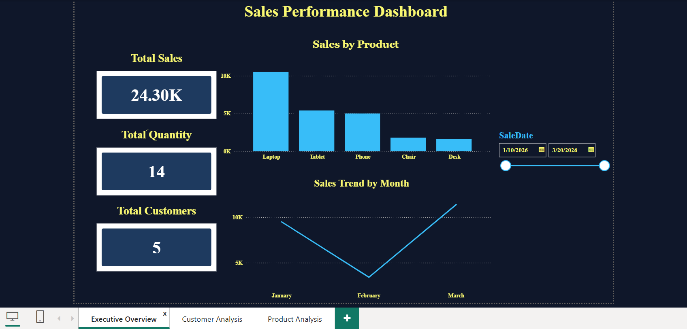

# Sales Performance Analytics Dashboard

## Project Overview
An end-to-end Sales Analytics project built using SQL Server and Power BI.  
The project focuses on analyzing sales performance, customer behavior, and product insights through interactive dashboards.

## Tools & Technologies
- SQL Server
- SQL Queries
- Power BI
- Data Modeling
- Data Visualization

## Database Structure

The project contains three main tables:

### Customers
- CustomerID
- CustomerName
- City
- Age

### Products
- ProductID
- ProductName
- Category
- Price

### Sales
- SaleID
- CustomerID
- ProductID
- SaleDate
- Quantity
- TotalAmount

## Dashboard Pages

### 1. Sales Performance Dashboard
Includes:
- Total Sales
- Total Quantity
- Total Customers
- Sales Trend by Month
- Sales by Product
- Date Filter

### 2. Customer Analysis
Includes:
- Top Customers by Sales
- Sales by City
- Customer Details Table

### 3. Product Analysis
Includes:
- Top Products by Sales
- Sales by Category
- Product Performance Table

## Project Screenshots

### Sales Performance Dashboard

### Customer Analysis

### Product Analysis

## Conclusion
This project demonstrates an end-to-end data analytics workflow, starting from database creation and SQL analysis to building interactive Power BI dashboards.
